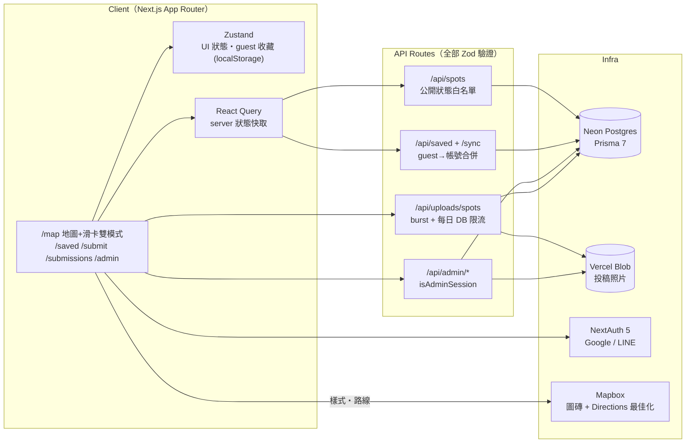

# OddSpot

**地圖優先的台灣獵奇景點探索 App** — 收錄不會出現在旅遊書上的地方:奇廟、廢墟、巨物、都市傳說。使用者在地圖上探索、滑卡片收藏、排今日行程、一鍵導航,也能投稿新景點進審核流程。

**Live demo**: [oddspot-pi.vercel.app](https://oddspot-pi.vercel.app) · 單人開發 · Next.js 16 + Mapbox GL + Prisma/Postgres

> English TL;DR: a map-first discovery app for Taiwan's quirky hidden spots — swipe to save, plan a 5-stop day trip with route optimization, navigate externally, and submit new spots through a moderation pipeline. Solo project; internal docs are in Traditional Chinese.

<!-- 截圖區：真機 QA 拍好圖放進 docs/assets/readme/ 後，把下面這張表解除註解
| 地圖探索 | 滑卡收藏 | 行程規劃 |
|---|---|---|
|  |  |  |
-->

---

## 系統架構



一句話版本:client 用 Zustand 管 UI 與 guest 狀態、React Query 管 server 快取;所有寫入走 Zod 驗證的 API routes 進 Neon Postgres;照片走 Vercel Blob;地圖與路線最佳化交給 Mapbox。

## 四個關鍵設計決策

### 1. Mapbox 深度客製,而不是內嵌 Google Maps

地圖是產品本體,不是配件。四個主題(terminal / blueprint / caution / midnight)各有一份 Mapbox style JSON + 一組 CSS 變數,**執行期同時切換**——marker、popup、RouteSheet 全部讀同一組變數,換主題等於整張地圖連同 UI 一次重繪。查詢採雙模式:定位半徑(5–50km)或視窗 bbox,拖地圖自動切換。行程規劃串 Mapbox Directions 做 5 點路線最佳化,導航則深連結到外部 Google Maps(iOS 無 app 時有 visibility-based fallback chain)。

### 2. Guest-first 的收藏同步

未登入就能收藏——存 localStorage(Zustand persist)。登入時 `useAuthSync` 把 guest 收藏**冪等合併**進 DB,再從 DB hydrate 回 store;之後每次收藏/移除都是**樂觀更新 + 背景同步 + 失敗自動回滾**。使用者永遠不等 spinner,換裝置也不掉資料。這條路徑有行為測試直接鎖住回滾邏輯。

### 3. 審核安全邊界:公開 API 永不洩漏未審內容

投稿進來是 `pending`,公開 API(列表/單筆/SSR 詳情)一律走狀態白名單,對 pending/rejected 回**與不存在完全相同的 404**,避免列舉攻擊。拒絕流程刻意排序:**先更新 DB(權威記錄)再 best-effort 清 Blob 圖片**——DB 失敗可安全重試,Blob 失敗只留可回收的孤兒,不會出現 DB 指著已刪圖片的謊報。防濫用採兩層:記憶體 burst 限流(減速帶)+ **DB 計數的每日上限**(投稿 5/天、照片 15/天,serverless 多 instance 下依然正確)。拒絕原因全鏈路可見(admin 填寫 → 投稿者在自己的狀態頁看到),但公開 API 拿不到這個欄位——有契約測試釘死。

### 4. Acid / Y2K 視覺系統當作工程約束

視覺規範寫成硬規則:顏色只能用 CSS 變數、圓角 2px、wireframe 元素 no fill。好處是**主題數量與元件數量解耦**——新元件只要遵守規則,四個主題自動全部成立。Landing 頁有 ~6,000 行 Three.js 點雲地球/月球(桌機+手機兩套),完成後**正式凍結**(ADR AD-10):dynamic import 隔離、只修 bug 不再迭代——控制單人專案複雜度的刻意取捨。

## 工程品質

- **71 個測試全綠**(`node:test`,零測試框架依賴):行為測試直接驗純函數模組(限流窗口、重複點判定、Google Maps 連結解析、收藏回滾),契約測試釘住安全邊界(公開 API 白名單、admin 保護、rejectReason 不外洩)
- **`npm run build` 零錯誤零警告**為提交門檻;TypeScript 全程無 `any`
- 架構決策記錄(ADR AD-1 ~ AD-10)與任務包制 roadmap 在 `docs/specs/`,狀態單一來源
- 三語 i18n(繁中/英/日,client-side 切換)

## Stack

| 層 | 選擇 |
|---|---|
| Framework | Next.js 16(App Router)· React 19 · TypeScript |
| 資料 | Prisma 7 + Neon Postgres(`@prisma/adapter-pg`) |
| 認證 | NextAuth 5 · Google / LINE OAuth |
| 地圖 | Mapbox GL · react-map-gl · Directions API |
| 狀態 | Zustand(UI/guest)· TanStack Query(server) |
| 動畫 | Framer Motion · GSAP · Three.js(landing,已凍結) |
| 圖片 | Vercel Blob(前端 Canvas 壓縮 ≤600KB 後上傳) |
| 測試 | node:test(71 tests,行為 + 契約) |
| 部署 | Vercel + Neon |

## 本地開發

```bash
git clone https://github.com/ArchiCodeKai/oddspot.git
cd oddspot && npm install
cp .env.example .env.local   # 填入下列值
```

必要環境變數:`NEXT_PUBLIC_MAPBOX_TOKEN`、`DATABASE_URL`(Postgres)、`AUTH_SECRET`、`AUTH_GOOGLE_ID/SECRET`、`AUTH_LINE_ID/SECRET`、`BLOB_READ_WRITE_TOKEN`、`ADMIN_EMAIL`(此 email 登入自動升 admin)。

```bash
npx prisma migrate dev   # 建表
npx prisma db seed       # 26 個真實台灣景點種子資料
npm test                 # 71 測試
npm run build            # webpack build(Turbopack 對 next/font 網路失敗的回報不可靠)
```

完整部署流程(Vercel / Neon / OAuth callback)見 [DEPLOYMENT.md](DEPLOYMENT.md)。

## 5 分鐘 Demo

照稿演示腳本(地圖 → 滑卡 → 行程 → 導航 → 投稿 → 審核):[docs/demo-script.md](docs/demo-script.md)

## 文件地圖

| 位置 | 內容 |
|---|---|
| `docs/specs/2026-07-03-*.md` | 產品規格・技術規格(ADR)・專案分析・roadmap(狀態唯一來源) |
| `.ai-context/` | 模組級技術筆記(map / spots / auth / swipe)與全域規範 |
| `docs/01~05-*/` | 早期規劃(架構、MVP、元件、狀態、API 設計) |

內部文件為繁體中文(單人專案,雙語維護不划算)。

## License

MIT

<!--
## 截圖佔位清單（真機 QA 時拍，存 docs/assets/readme/）
- map.png      桌機地圖模式：pin + popup + 頂列（挑 blueprint 或 midnight theme）
- swipe.png    手機滑卡：卡片 + 手勢提示或拖曳中的 edge hint
- route.png    RouteSheet 展開：5 點行程 + 最佳化後路線畫在地圖上
- saved.png    收藏頁：卡片 + 霓虹回地圖鈕（可選）
- submit.png   投稿頁：貼 Google Maps 連結 + 地圖預覽（可選）
- admin.png    admin 審核：填拒絕原因面板（可選）
- landing.gif  landing 3D 開場 3–5 秒 GIF（可選，檔案 <5MB）
-->
